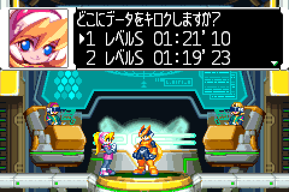

# ストーリーデータ

ロックマンゼロ3のストーリーのセーブデータです。

ストーリーデータN (N=1..5) といったときは、ストーリーのセーブデータ の N番目を指します。



## 内容

ストーリーデータは全部で、608バイトです。

```
  Byte:
    0..16    ヘッダ
    16..607  セーブデータ
```

と、ヘッダとセーブデータに分かれています。

## ヘッダ

ヘッダの内容は次のようになっています。

```
  Byte:
    0..3:   INTI(マジックナンバー)
    4..7:   (ヘッダを除くストーリーデータの)チェックサム
    8..11:  セーブデータのバイトサイズ(592バイト？)
    12:     0x0B
    13..14: ???
    15:     何番目のストーリーデータか(1~5)
    16..:   TODO
```

ヘッダは、`0x03002a1c..0x03002a2b` に配置されていて、セーブ時にSRAMに書き込まれます。

## セーブデータ

セーブデータは、`0x02036dbc..0x2036ffb` の単純なコピーです。

```
  Byte:
    0..1:     ???
    2..3:     ゲームモード
                ここを変えただけでは完全には切り替わりません
                00: ノーマルモード
                01: ハードモード
                02: アルティメットモード
    4..5:     ステージID
                ベースでセーブするので17で固定(変えてもベースで始まる)
    6..7:     プレイヤーランク(変えても意味はなし)
    8..19:    任意(0?)
    20..103:  ストーリー進行度(後述)
    104..187: ストーリー進行度(20..103バイト)のコピー
    188..235: ディスク収集情報
    236..283: ディスク収集情報(188.235バイト)のコピー
    284..359: エルフ収集情報
    360..435: エルフ収集情報(360..435バイト)のコピー
    436..591: プレイ情報(後述)
```

<details>
  <summary>ストーリー進行度</summary>

```
  Byte:
    00:     フラグ
              bit 6: ここは絶対0(デモプレイ中のフラグ)
              それ以外は変更しても影響なさそう
    01..02: ストーリーフラグ(後述)
    03:     変更する意味なし(ボスラッシュ時の撃破フラグ)
    04:     エルフ使用フラグ
              bit 0: プチット
              bit 1: キーナイト系
              bit 2: ハンマーガ系
              bit 3: ストパーラ系
              bit 4: ???(0)
              bit 5: デルピーナ
              bit 6: メットール系
              bit 7: バイッス
    05:     エルフ使用フラグ(一部)
              bit 0: エワーネ系
              それ以外はステージギミックフラグで変更する意味なし
    06:     ステージギミックフラグ(ステージのロード時にリセット)
    07:     ???
    08..36: 会話の進行度
    37..77: 雑魚敵撃破数(ステージのロード時にリセット)
    78..79: 火山のコンテナの移動量(ステージのロード時にリセット)
    80..83: ???
```

```
  ストーリーフラグ(16bit)
    bit00: 壊れた宇宙船をクリアしたか
    bit01: セルヴォと顔合わせしたか
    bit02: 序盤4ミッション進行中
    bit03: 序盤4ミッション終了済み
    bit04: ???
    bit05: ???
    bit06: 中盤4ミッション開始前
    bit07: 中盤4ミッション進行中
    bit08: ハルピュイア回復後
    bit09: 中盤4ミッション開放済み
    bit10: ディスク解析中
    bit11: ???
    bit12: ディスク解析完了 (bit10が1の場合)
    bit13: バイル研究所突撃
    bit14: ???
    bit15: ???

    例:
      0x0000: ゲーム開始時
      0x0003: 序盤の4ミッション開始前
      0x0007: 序盤の4ミッション中
      0x003F: 中盤の4ミッション開始前
      0x007F: 中盤の4ミッション中
```
</details>

<details>
  <summary>プレイ情報</summary>

```
  Byte:
    000:      残機数
    001:      プレイヤーランク
    002:      コードネーム(後)
    003:      ???
    004:      コードネーム(前)
    005:      ???
    006:      全エルフ取得済みフラグ
    007:      ???
    008:      ???
    009:      ???
    010..011: 今までにクリアしたステージのスコアの合計
    012..015: プレイ時間(フレーム単位)
    016:      クリアカウント(今までにクリアしたステージの数。スコアのアベレージ算出で利用)
    017:      クリアカウントのコピー(不使用？)
    018:      ???
    019:      最後にクリアしたステージID
    020..023: ミッションクリアフラグ
    024..027: ミッションクリアフラグのコピー(不使用？)
    028..079: ???
    080..081: サテライトエルフ1,2
    082..083: ???
    084..085: フュージョンエルフのペナルティで何点減点されるか
    086..087: Eクリスタル
    088..091: サブタンクのHP x 4
    092:      メイン武器
    093:      サブ武器
    094:      属性
    095:      ヘッド
    096:      ボディ
    097:      フット
    098..099: 装備しているEXスキル
    100..101: 開放済みEXスキル
    102:      開放済み武器
    103:      開放済みヘッド
    104:      開放済みボディ
    105:      開放済みフット
    106:      メニューでのゼロの色
    107:      ???
    108..117: キーコンフィグ
    118..119: ???
    120..121: 0(チャージ段階)
    122:      ???
    123:      ???
    124:      最大HP
    125:      0
    126..127: ???
    128..155: 変えても意味なし？
```
</details>

## チェックサム

チェックサムが一致してなくても、ストーリーを再開できます。

```c
  s32 checksum = 0;
  for (i = 0; i < 592; i++) {
      checksum += (s32)load8(0x02036dbc+i);
  }
```

## バグ？

セーブデータにはプレイ時間がフレーム単位で記録されていますが、チェックサム計算時とセーブデータ保存時のフレームが違うため、チェックサムが計算時と1ずれてしまっています。

そのため、ストーリーデータ読み込み時に、チェックサムがどうしても一致せず、バックアップデータの3回目のリトライ時に読み取ったセーブデータを使ってストーリーを再開しているように見えます。

